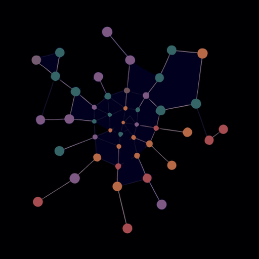
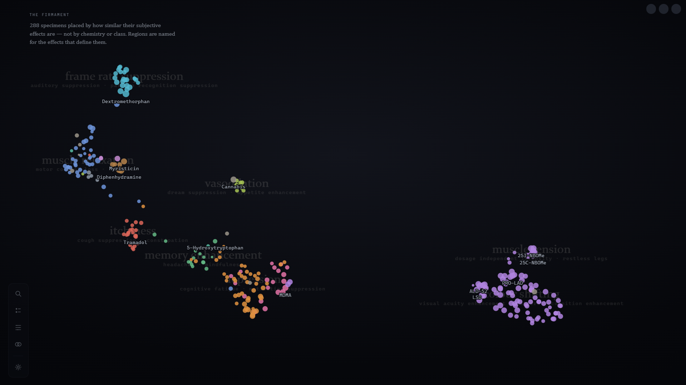
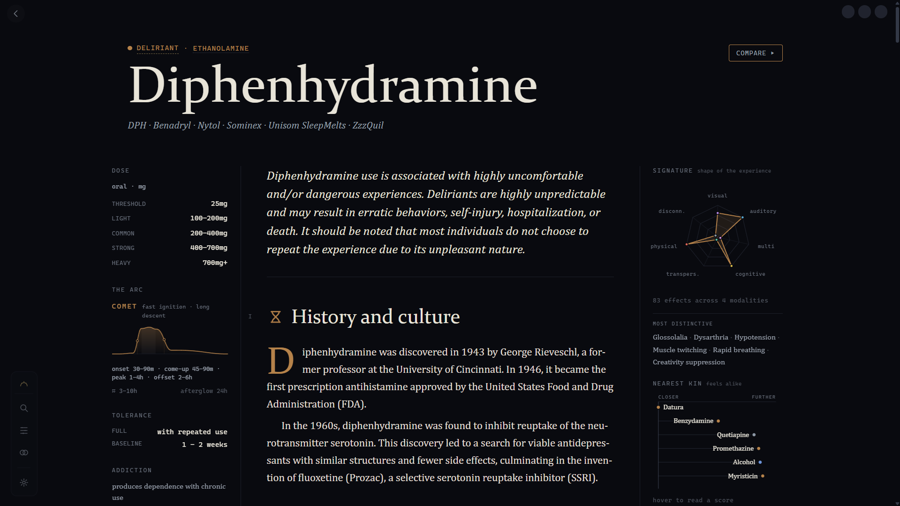
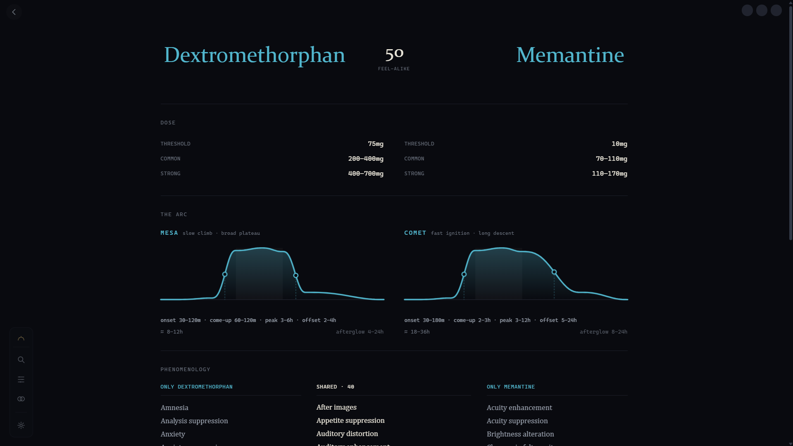

<div align="center">



# Substancia

**A field guide to how psychoactive substances feel.**

288 specimens, placed by how their subjective effects feel — not by chemistry, not by class. Dosing, pharmacology, interactions, and cited prose for every one of them.

[](LICENSE)
[](https://tauri.app)
[](https://react.dev)
[](https://www.rust-lang.org)
[](https://github.com/feelsunbreeze/substancia/releases/latest)
[](https://github.com/feelsunbreeze/substancia/stargazers)

[**Download**](#-download) · [**Ko-fi**](https://ko-fi.com/feelsunbreeze) · [**Build from source**](#-build-from-source)

</div>

---

## What is Substancia?

Substancia is a full pharmacology reference desktop app — dose ranges, duration arcs, tolerance curves, addiction potential, receptor-binding profiles, interaction warnings, and cited prose covering history, pharmacology, chemistry, forms, toxicity, and legal status for every specimen.

It's not a wiki mirror. It's a purpose-built visual interface: specimens are placed in **the Firmament** by how similar their subjective effects are, so you can explore by *feeling*, not by alphabetical drug class. Compare any two specimens side by side. See nearest kin by shared effects, and by shared receptor targets — and where the two disagree.

Fully free, no paywalled tier, nothing held back.

---

## ✨ Features

- **🌌 The Firmament** — every specimen placed by effect similarity, not chemistry. Regions are named for the effects that define them.
- **📋 Specimen plates** — dose ranges, duration arcs, tolerance, addiction potential, neurochemistry, interactions, and cited prose.
- **⚠️ Hazard callouts** — fatal-interaction and carcinogenicity warnings are pulled out into their own boxed callouts, not buried in body text.
- **🧬 Kinship & divergence** — nearest specimens by shared subjective effects, and separately by shared receptor targets, plus where the two views disagree.
- **⚖️ Compare (Diptych)** — side-by-side comparison of any two specimens.
- **🗂️ Taxonomy** — browse every drug class directly.
- **🔒 Fully local** — no account, no telemetry, no network calls beyond loading the bundled dataset.

---

## 🖼 UI Showcase

<div align="center">


<br /><sub><b>The Firmament</b> — 288 specimens placed by how similar their subjective effects are.</sub>

<br /><br />


<br /><sub><b>Specimen plate</b> — dosing, the duration arc, tolerance, neurochemistry, hazard callouts, and cited prose.</sub>

<br /><br />


<br /><sub><b>Diptych</b> — any two specimens, side by side.</sub>

</div>

---

## 🛠 Tech Stack

| Layer | Technology |
|---|---|
| Shell | [Tauri 2](https://tauri.app) — native window, OS integrations |
| UI | [React 19](https://react.dev) + Vite |
| Core | [Rust](https://www.rust-lang.org) |
| Visualization | [D3](https://d3js.org) — the Firmament layout, kinship graphs |
| Data | Compiled from [PsychonautWiki](https://psychonautwiki.org) by a private cleaning/build pipeline |
| Packaging | NSIS + MSI (Windows) · DMG (macOS) · `.deb` + AppImage (Linux) |

---

## 📥 Download

| Platform | Architecture | Download |
|---|---|---|
| **Windows** | x64 | [`substancia_x64-setup.exe`](https://github.com/feelsunbreeze/substancia/releases/latest) |
| **macOS** | Apple Silicon | [`substancia_aarch64.dmg`](https://github.com/feelsunbreeze/substancia/releases/latest) |
| **macOS** | Intel | [`substancia_x64.dmg`](https://github.com/feelsunbreeze/substancia/releases/latest) |
| **Linux** | x86_64 | [`.deb`](https://github.com/feelsunbreeze/substancia/releases/latest) · [`.AppImage`](https://github.com/feelsunbreeze/substancia/releases/latest) · [`.rpm`](https://github.com/feelsunbreeze/substancia/releases/latest) |

> Releases are not signed — expect an OS gatekeeper warning on first launch.

---

## 🔨 Build from Source

**Prerequisites:** [Rust](https://rustup.rs) stable · [Node.js](https://nodejs.org) 20+ · [pnpm](https://pnpm.io)

```bash
# Clone
git clone https://github.com/feelsunbreeze/substancia.git
cd substancia

# Install dependencies
pnpm install

# Run in dev mode (hot-reload UI + Rust backend)
pnpm tauri dev

# Build a release binary + installer for your platform
pnpm tauri build
```

Built artifacts land in `src-tauri/target/release/bundle/`.

---

## 🤝 Contributing

Substancia is open source under the GPL — forks and derivatives stay open, too. Bug fixes, new specimen data corrections, accessibility, and UI polish are all welcome. Open an issue first for anything large so we can align on direction before you sink time into a PR.

---

## ☕ Support

Substancia will always be free. No paywalled tier, no "premium" specimens, no ads, no telemetry sold to anyone — every specimen, every feature, for everyone, forever.

That only works if it's sustainable. Compiling and cleaning a 288-specimen dataset, building the visual layer on top of it, and keeping it maintained across Windows, macOS, and Linux is real, ongoing work — and every dollar from Ko-fi goes straight back into keeping it free for the next person who needs it, instead of putting a price tag on the app itself.

If Substancia has been useful to you — saved you a dangerous combo, answered a question a hospital pamphlet wouldn't, or just been a nicer way to learn — consider chipping in what a coffee costs. It adds up, and it's the only thing standing between this project and a paywall:

[](https://ko-fi.com/feelsunbreeze)

Companies and orgs are welcome to sponsor too — see [the website](#) for sponsorship details.

---

## 📄 License

GPL-3.0 © [feelsunbreeze](https://github.com/feelsunbreeze) — see [LICENSE](LICENSE).
